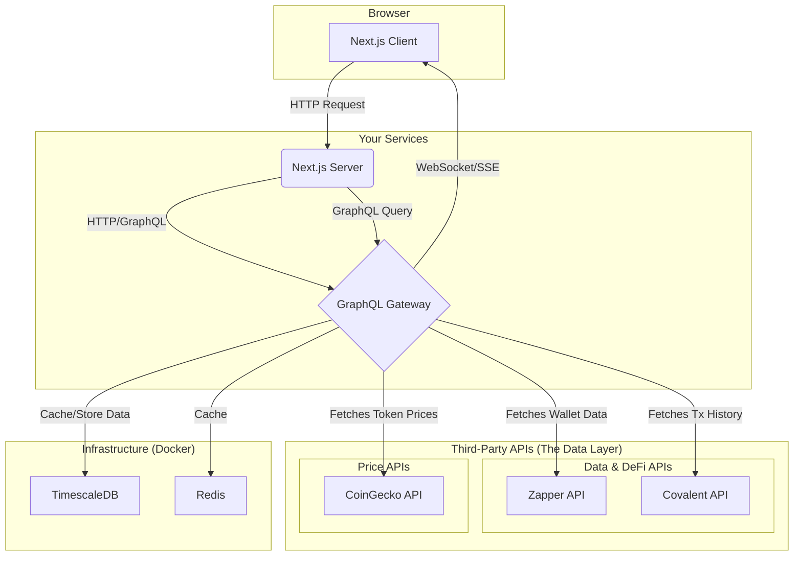

# 🚀 Crypto Portfolio Tracker

A production-grade, multichain cryptocurrency wallet tracker featuring a real-time GraphQL API and a reactive Next.js frontend.

**Live Demo: Coming Soon**

## Project Overview

This project demonstrates how to build a robust, scalable, and maintainable portfolio tracker by orchestrating best-in-class third-party APIs. It showcases expertise in modern full-stack development, API design, and production-grade infrastructure.

Instead of building a custom data indexer from scratch, this application leverages a strategic, API-driven approach to deliver a feature-rich experience quickly and reliably, demonstrating a pragmatic approach to software engineering.

-----

## ✨ Core Features

* ✅ **Comprehensive Multi-Chain Tracking**: Instantly view token balances, NFTs, and transaction history across major EVM chains like Ethereum, Polygon, and Base, powered by the Zapper and Covalent APIs.
* ✅ **Live Portfolio Analytics**: Get a real-time overview of your net worth with historical value charts, performance metrics, and PnL calculations.
* ✅ **In-Depth DeFi Positions**: Track your supplied assets, borrows, and rewards from leading DeFi protocols like Aave, Uniswap, and Compound.
* ✅ **Real-time API**: A unified GraphQL API aggregates data from multiple sources and streams updates to the frontend via WebSockets.
* ✅ **Deep Observability**: End-to-end distributed tracing with OpenTelemetry and Jaeger provides critical insights into application performance and behavior.

-----

## 🛠️ Tech Stack & Architecture

This project uses a modern, API-driven architecture designed for scalability and maintainability.

* **Frontend**: Next.js 15, React 19, TypeScript, Tailwind CSS, TanStack Query
* **Backend (API)**: GraphQL Yoga, Prisma, Apollo Client (for API federation)
* **Data Sources**: Zapper API, Covalent API, CoinGecko API
* **Database**: TimescaleDB (for time-series data), Redis (for caching)
* **Infrastructure**: Docker, Turborepo, GitHub Actions
* **Observability**: OpenTelemetry, Jaeger (Tracing), Prometheus/Grafana (Metrics - planned)

### Architecture Diagram



-----

## 🚀 Getting Started

Get the project running on your local machine for development and testing.

### Prerequisites

* **Node.js**: v22.x or higher
* **pnpm**: v10.x or higher (`npm install -g pnpm`)
* **Docker Desktop**: Latest version

### Quick Start

1.  **First-Time Setup**: Run this command once to install dependencies and configure your environment.

    ```bash
    ./scripts/dev/setup.sh
    ```

2.  **Run the App**: Start all services with a single command.

    ```bash
    pnpm dev:full
    ```

Your services will be available at:

* **Web App**: `http://localhost:3000`
* **GraphQL Gateway**: `http://localhost:4000/graphql`
* **Jaeger Tracing**: `http://localhost:16686`
* **Redis Insight**: `http://localhost:8001`

-----

## ⚙️ Available Scripts

| Command             | Description                                                     |
|:--------------------|:----------------------------------------------------------------|
| `pnpm dev:full`     | ✅ **(Recommended)** Starts all services (infra + apps).         |
| `pnpm dev`          | Starts only the Node.js applications (frontend and API).        |
| `pnpm dev:infra`    | Starts only the backend infrastructure via Docker.              |
| `pnpm stop:infra`   | 🛑 Stops all running Docker services.                           |
| `pnpm build`        | Builds all applications for production.                         |
| `pnpm lint`         | Lints the entire monorepo using Biome.                          |
| `pnpm docker:reset` | ⚠️ **Deletes all Docker data\!** Resets the database and cache. |
| `pnpm docker:logs`  | Tails the logs for all running Docker services.                 |

For more detailed workflows, see [DEVELOPMENT.md](DEVELOPMENT.md).

-----

## 🔭 API Overview

The GraphQL API provides queries, mutations, and subscriptions for wallet and portfolio management.

* **Queries**:
  * `wallet(address: String!, chain: Chain!): Wallet`
  * `portfolio(walletAddresses: [String!]!): Portfolio`
  * `transactions(walletAddress: String!, chain: Chain!): TransactionConnection!`
* **Mutations**:
  * `addWallet(input: AddWalletInput!): Wallet!`
  * `syncWallet(address: String!, chain: Chain!): SyncResult!` (Refreshes data from APIs)
* **Subscriptions**:
  * `priceUpdates(tokenIds: [ID!]!): TokenPrice!`

Explore the full schema live at `http://localhost:4000/graphql`.

-----

## 🤝 Contributing

1.  Run health checks: `./scripts/health-check.sh`
2.  Ensure tests pass: `pnpm test`
3.  Check types: `pnpm type-check`
4.  Format and lint code: `pnpm format` and `pnpm lint`

See [DEVELOPMENT.md](DEVELOPMENT.md) for more details.

-----

## License

[MIT](https://www.google.com/search?q=LICENSE)