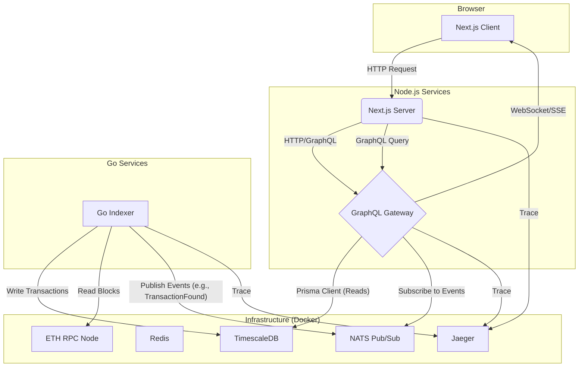

# Crypto Portfolio Tracker

A production-grade, multi-chain cryptocurrency wallet tracker designed to showcase advanced software engineering practices. This project features a Go-based indexer, a real-time GraphQL API, and a reactive Next.js frontend, all running on a containerized, observable infrastructure.

**Live Demo: Coming Soon**

## Project Overview

This project demonstrates the implementation of robust, scalable, and maintainable systems in the cryptocurrency domain, highlighting expertise in:

- **Backend Engineering in Go**: High-performance, concurrent blockchain data indexing with reorg handling.
- **Modern API Design**: Real-time data streaming with GraphQL, WebSockets, and NATS.
- **Full-Stack Development**: A reactive and responsive frontend using Next.js 15.
- **Production-Grade Infrastructure**: Containerization with Docker and readiness for Kubernetes orchestration.
- **Deep Observability**: End-to-end distributed tracing and metrics with OpenTelemetry and Jaeger.

## Core Features

- ✅ **Multi-Chain Indexing**: Go-based indexer for Ethereum (extensible to Polygon, Base, etc.), with support for ERC-20 transfers and native transactions.
- ✅ **Real-time Portfolio**: Live updates pushed via WebSockets from a GraphQL API.
- ✅ **Transaction History**: Ingestion and storage of on-chain transactions in a time-series database.
- ✅ **DeFi Position Tracking**: Schema support for protocols like AAVE, Compound, etc. (third-party API integration planned with Zapper).
- ✅ **Performance Analytics**: Historical portfolio value charts and PnL calculations.
- ✅ **Comprehensive Observability**: Distributed tracing and metrics across all services.

## Tech Stack & Architecture

This project uses a modern, microservices-oriented architecture designed for scalability and maintainability.

| Category          | Technology                                      |
|-------------------|-------------------------------------------------|
| **Frontend**      | Next.js 15, React 19, TypeScript, Tailwind CSS, TanStack Query |
| **Backend (API)** | GraphQL Yoga, Prisma, NATS                      |
| **Backend (Indexer)** | Go (go-ethereum), gRPC, CoinGecko              |
| **Database**      | TimescaleDB (for time-series data), Redis (for caching) |
| **Infrastructure**| Docker, Turborepo, GitHub Actions               |
| **Observability** | OpenTelemetry, Jaeger (Tracing), Prometheus/Grafana (Metrics - planned) |

### Architecture Diagram



## Getting Started

This guide will get you a copy of the project up and running on your local machine for development and testing purposes.

### Prerequisites

- **Node.js**: v22.x or higher
- **pnpm**: v10.x or higher (`npm install -g pnpm`)
- **Docker Desktop**: Latest version
- **Go**: v1.22.x or higher (for local indexer debugging)

### First Time Setup

Run this once to set up the environment:

```bash
./scripts/dev/setup.sh
```

This will:
- Check prerequisites
- Create environment files
- Install dependencies
- Generate Prisma client

### Quick Start

The fastest way to get the entire environment running is with a single command.

```bash
# This command starts all Docker services and the Node.js apps concurrently.
pnpm dev:full
```

Your services will be available at:

- **Web App**: http://localhost:3000
- **GraphQL Gateway**: http://localhost:4000/graphql
- **Jaeger Tracing UI**: http://localhost:16686
- **Redis Insight UI**: http://localhost:8001
- **NATS Monitor**: http://localhost:8222

### Manual Startup (Step-by-Step)

If you prefer to run the infrastructure and applications in separate terminals:

**Terminal 1: Start Docker Infrastructure**  
This will start the database, indexer, Redis, and NATS.

```bash
pnpm dev:infra
```

**Terminal 2: Start Web and API Servers**  
This will start the Next.js and GraphQL Yoga servers with hot-reloading.

```bash
pnpm dev
```

### Available Scripts

This project uses pnpm as its package manager and turbo as its build system.

| Command            | Description                                      |
|--------------------|--------------------------------------------------|
| `pnpm dev:full`   | (Recommended) Starts all services (infra + apps) in one terminal. |
| `pnpm dev:infra`  | Starts only the backend infrastructure (Docker services). |
| `pnpm dev`        | Starts only the Node.js applications (Next.js and GraphQL). |
| `pnpm stop:infra` | Stops all running Docker services.               |
| `pnpm build`      | Builds all applications for production.          |
| `pnpm lint`       | Lints the entire monorepo using Biome.           |
| `pnpm test`       | Runs all tests across the monorepo.              |
| `pnpm docker:reset` | ⚠️ Deletes all Docker data! Resets the database, cache, etc. |
| `pnpm docker:logs` | Tails the logs for all running Docker services.   |

### Development Workflows

See [DEVELOPMENT.md](DEVELOPMENT.md) for detailed workflows, including:
- Making database changes
- Adding new GraphQL types
- Working with UI components
- Health checks and diagnostics
- Common issues and solutions

## API Overview

The GraphQL API provides queries, mutations, and subscriptions for wallet and portfolio management. Key endpoints:

- **Queries**:
    - `wallet(address: String!, chain: Chain!): Wallet`
    - `portfolio(walletAddresses: [String!]!): Portfolio`
    - `transactions(walletAddress: String!, chain: Chain!): TransactionConnection!`

- **Mutations**:
    - `addWallet(input: AddWalletInput!): Wallet!`
    - `syncWallet(address: String!, chain: Chain!): SyncResult!`

- **Subscriptions**:
    - `walletActivity(address: String!, chain: Chain!): WalletEvent!`
    - `priceUpdates(tokenIds: [ID!]!): TokenPrice!`

Full schema available at http://localhost:4000/graphql (GraphiQL interface).

## Observability

The project includes comprehensive observability:
- **Tracing**: OpenTelemetry with Jaeger UI at http://localhost:16686
- **Metrics**: Planned integration with Prometheus/Grafana
- **Logging**: Structured logs with Pino (configurable)

All services are instrumented for end-to-end tracing.

## Contributing

1. Run health checks: `./scripts/health-check.sh`
2. Ensure tests pass: `pnpm test`
3. Check types: `pnpm type-check`
4. Format code: `pnpm format`
5. Lint code: `pnpm lint`

See [DEVELOPMENT.md](DEVELOPMENT.md) for more details.

## License

MIT